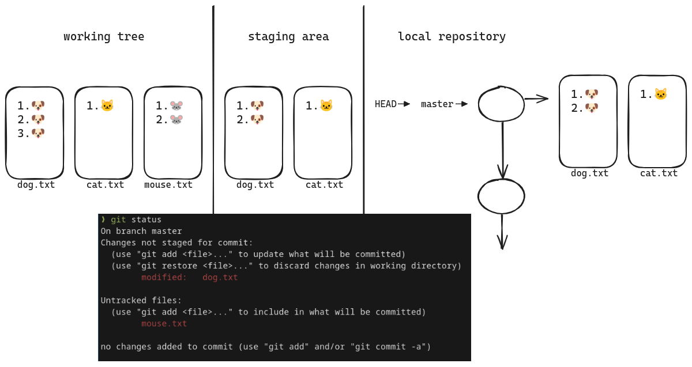
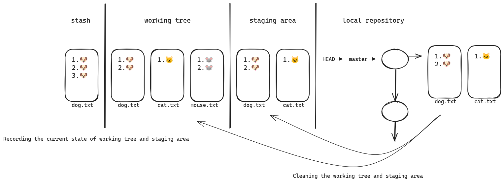

# Git Stash and Git Worktree

We all face situations where we have uncommitted changes but need to switch to another branch. In such cases, we have a few options: we can make a temporary commit with a placeholder message to be fixed later, 
use stashing to save the changes, or take advantage of Git worktrees to work on multiple branches simultaneously.

## Git Stash

git stash does two things:

1. **Recording the current state:**  
   Git stash saves the current state of your working tree and staging area. This means it stores any uncommitted changes you have made, allowing you to return to them later.

2. **Cleaning the working tree and staging area:**  
   It updates the working tree and staging area to match the commit that the HEAD is pointing to. This effectively restores your working directory to its last committed state.

### Example

In the example below, our current situation is as follows: the staging area and HEAD are matching, meaning there are no staged changes. We have modified the `dong.txt` file and also created a new file called `mouse.txt`.



After executing the `git stash` command, our situation will look like this:



As you can see, our current state has been recorded in the stash area. The working tree and staging area have been updated to match the state of the commit that the `HEAD` is pointing to.

**Note:** By default, `git stash` does not include untracked files (like `mouse.txt`). To include untracked files, you can use `git stash --include-untracked`.

## Git Stash Useful Commands

- `git stash push -m "message"`: Create a stash with a custom message.
- `git stash list`: View all stashes.
- `git stash pop`: Apply a stash and remove it from the list.
- `git stash apply`: Apply a stash without removing it from the list.
- `git stash clear`: Remove all stashes.
- `git stash drop <stash>`: Delete a specific stash.
- `git stash pop/apply --index`: Keep staged changes when applying a stash. (By default files that were staged become unstaged after applying a stash)
- `git stash show`: Display a summary of stash files and changes.
- `git stash show -p`: Display a detailed patch of the changes.
- `git stash branch <branch_name> <stash>`: Create a new branch from an existing stash.

## Git Worktree

Many developers are not aware of Git worktrees. The `git worktree` command allows you to check out multiple branches simultaneously. This means you can work on different branches in separate directories without having to switch back and forth between them.

Imagine you're working on a new feature in one branch when a critical bug is discovered in the `production` branch that needs immediate fix. Instead of using `git stash` to save your changes temporarily, you can use Git worktrees to manage multiple branches without interrupting your workflow. With Git worktrees, you can check out a branch in a new directory outside your current working directory. Here’s how to do it:

``` bash
git worktree add ../project-hotfix production
```
In this command, `../project-hotfix` is the target directory for the new worktree, and `production` is the branch name. This creates a new directory called `project-hotfix`, where you can navigate, make the necessary fixes, commit them, and continue working. Meanwhile, your original work on the feature branch remains intact.
```
.
├── project                  # Your original working directory (feature branch)
└── project-hotfix           # New worktree directory for fixing the bug (production branch)
```
## Git Worktree Useful Commands

- `git worktree list`: List all your worktrees.
- `git worktree remove <worktree-path>`: Remove a specific worktree.
- `git worktree info <worktree-path>`: Display information about a specific worktree.
- `git worktree prune`: Remove references to worktrees that no longer exist on disk.

